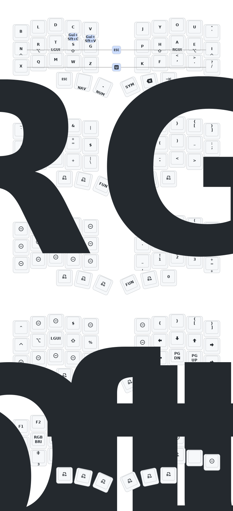

# Corne Dongle Firmware

This repository contains the ZMK firmware configuration for a split Corne keyboard using a central USB Dongle and two wireless peripherals. Forked from: [zmk-corne-dongle](https://github.com/a741725193/zmk-corne-dongle)

## Corne Keymap

---

## Modifying the Keymap

To change your layout, behaviors, or combos, edit the following file:
`config/eyeslash_corne.keymap`

## Building the Firmware

This repository is configured with GitHub Actions to automatically build your firmware in the cloud.

1. Commit and push your changes to the `main` branch.
2. Go to the **Actions** tab in your GitHub repository.
3. A workflow named **Build ZMK firmware** will start automatically.
4. Once completed (green checkmark), click on the run and download the generated firmware artifact from the bottom of the summary page.

## Flashing the Firmware

Because this is a Dongle setup, you must flash the correct `.uf2` file to the correct physical device. 

Unzip the downloaded `firmware.zip`. You will see files similar to these:
*   `eyeslash_corne_central_dongle_oled.uf2` (For the USB Dongle)
*   `eyeslash_corne_peripheral_left...uf2` (For the Left Half)
*   `eyeslash_corne_peripheral_right...uf2` (For the Right Half)

### Flashing Rules:
*   **Keymap Changes Only:** If you only modified the `.keymap` file (moving keys, changing combos), **you only need to flash the USB Dongle**. The left and right halves do not need to be updated.
*   **Hardware/Settings Changes:** If you modified any `.conf` or `.overlay` files (e.g., enabling Soft Off, changing RGB settings, adding encoders), you must flash **all three devices** (Dongle, Left Half, and Right Half).

### Flashing Steps:
1. Connect the specific device (Dongle or one Keyboard Half) directly to your computer via USB.
2. Double-tap the physical reset button on that device to enter bootloader mode. A new USB drive (e.g., `NICENANO`) will appear on your computer.
3. Drag and drop the corresponding `.uf2` file onto that drive.
4. The drive will automatically disconnect and the device will restart with the new firmware.

---
